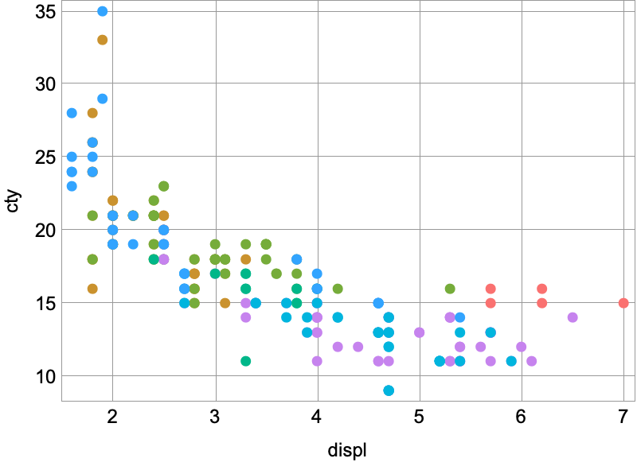
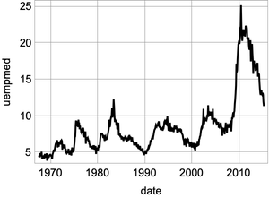

# ggplot: A grammar of graphics implementation for Wolfram Language

## General usage

```
ggplot[dataset, "x" -> "var", "y" -> "var", additional aesthetics and geoms...]

ggplot["data" -> dataset, "x" -> "var", "y" -> "var", additional aesthetics and geoms...]

dataset //
    ggplot["x" -> "var", "y" -> "var", additional aesthetics and geoms...]
```

## Currently supported geoms

```
geomPoint[]
geomLine[]
geomPath[]
geomSmooth[]
geomParityLine[]
geomHLine[]
geomVLine[]
```

## Currently supported scales

```
scaleXLinear[]
scaleXLog[]
scaleXDate
scaleYLinear[]
scaleYLog[]
scaleYDate
```

## Major functionality still to work or working through:

- Ability to use functions inside aesthetics (i.e. "color" -> `Function[#var < 8]`)
- Also need to be able to use functions inside x and y (i.e. "x" -> `Function[#x * 5]`)
- Scaling (ensure correct functionality and continue to add additional scaling functions)
- Legends
- Faceting
- geoms other than lines and points (columns, histograms, box plots etc.)
- Textual axes (for things like bar chart)
- Coordinates
- Labels

## Examples

```
mpg//ggplot[geomPoint["x"->"displ","y"->"cty","color"->"class"]]
```


```
economics//
	ggplot[
		"x"->"date","y"->"uempmed",geomLine[],scaleXDate[]
	]
```
